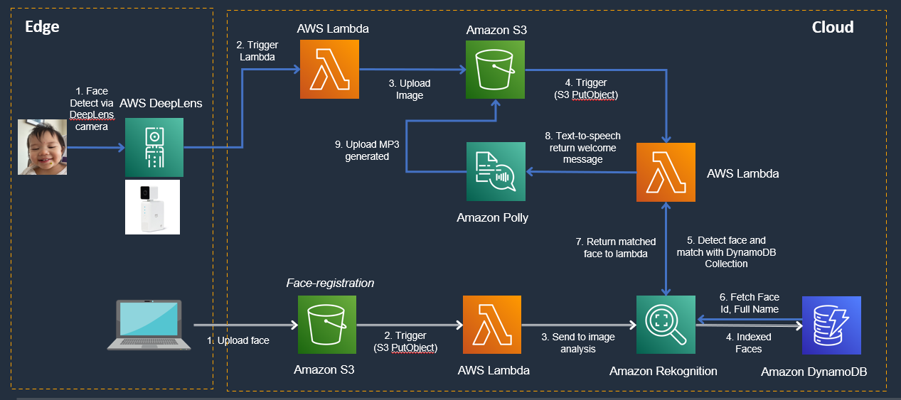
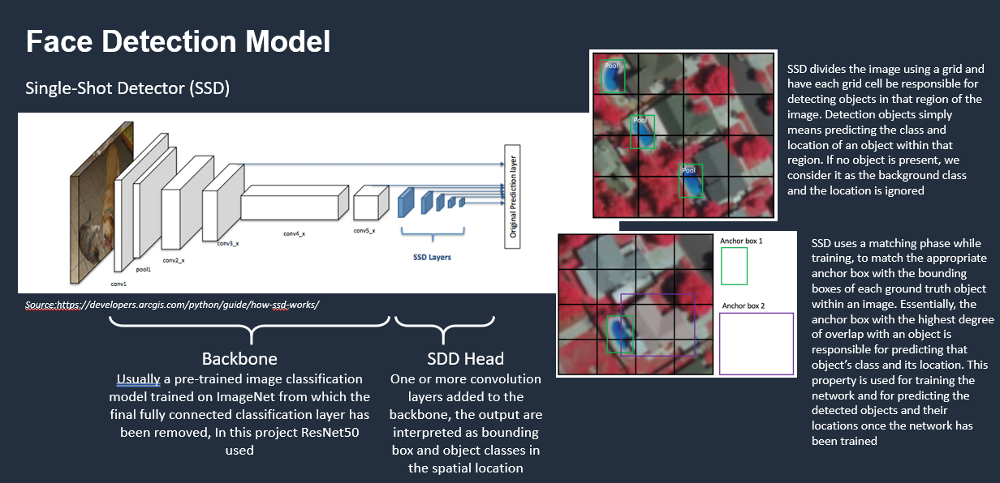

# aws_deeplens_face_recognition_project

## **Objectives**

This project aims at developing a computer vision application with capability of detecting and recognizing faces based on ML algorithms and AWS cloud services and deployed the application on Amazon DeepLens as edge device.

## **Architecture**

## **Features**
- Detect faces via DeepLens camera
- Match faces with registered profile
- Generate welcome message specific to each profile

## **Development Environment**
python 3.7, AWS Linux

## **Face Detection Model Overview**

